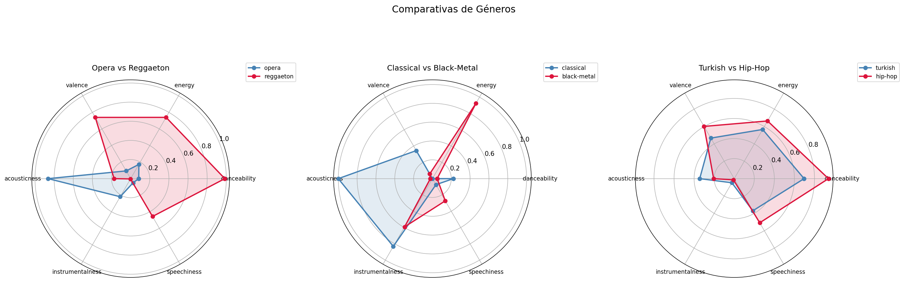
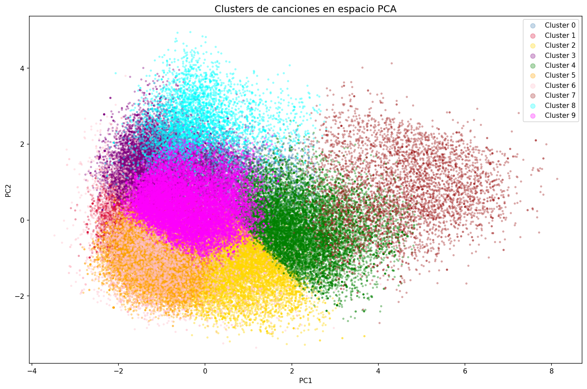

# Spotify Genre Analysis

## ¿De qué trata este proyecto?
Análisis exploratorio y clustering de más de 100.000 canciones de Spotify 
para descubrir qué hace sonar diferente a cada género musical y qué géneros 
comparten un ADN sonoro similar pese a ser culturalmente distintos.

## Visualizaciones destacadas

## Motivación
¿Tienen los géneros musicales fronteras sonoras claras o son simplemente 
etiquetas culturales que los humanos hemos inventado?

Esta pregunta me llevó a analizar más de 100.000 canciones de Spotify 
usando sus características de audio: energía, bailabilidad, positividad 
emocional, acústica... para descubrir qué hace sonar único a cada género 
y si realmente existen diferencias objetivas entre ellos.

Como amante de la música y estudiante de Ingeniería Informática, quería 
ir más allá de la intuición y dejar que los datos respondieran.

## Stack tecnológico
- Python, Pandas, NumPy
- Matplotlib, Seaborn
- Scikit-learn (KMeans, PCA, MinMaxScaler)
- Jupyter Notebooks

## Dificultades encontradas

**1. Restricciones de la API de Spotify** :
Inicialmente el proyecto estaba diseñado para extraer datos directamente 
de la API de Spotify. Sin embargo, en 2024 Spotify restringió el acceso 
a endpoints clave como audio-features y tracks para aplicaciones en modo 
desarrollo. Solución: descarga de un dataset público de Kaggle con más 
de 114.000 canciones y sus características de audio.

**2. Dataset sin columna de año** :
El dataset de Kaggle no incluía fechas de lanzamiento, lo que imposibilitaba 
el análisis temporal que era el objetivo inicial. Intenté enriquecer el 
dataset haciendo un merge con otra fuente que sí tenía años, pero el 
solapamiento de track_ids fue de apenas el 9%, insuficiente para un 
análisis riguroso.

**3. Pivote del enfoque** :
Ante estas limitaciones decidí cambiar el foco del análisis: en vez de 
estudiar la evolución temporal de la música, analicé las diferencias 
sonoras entre géneros. El resultado fue un análisis igual de rico 
y con hallazgos más sorprendentes de lo esperado.

## Hipótesis iniciales

Antes de comenzar el análisis, mis expectativas eran:

**1.** Los géneros musicales modernos y populares tendrían características 
sonoras muy similares entre sí, mientras que los géneros más antiguos 
o nicho serían más diferenciados.

**2.** El algoritmo de clustering agruparía los géneros por "familias", 
es decir, subgéneros de un mismo árbol: techno con house y EDM, 
metal con hardcore y grindcore, etc.

**3.** Features como energy y danceability serían las que más 
diferenciarían a los géneros entre sí.

## Flujo de Trabajo

1. **Adquisición de datos** :
   Descarga del dataset de Kaggle y primera exploración para entender 
   la estructura, tipos de datos y posibles problemas de calidad.

2. **Limpieza y preprocesado** :
   Eliminación de registros corruptos (duration_ms = 0), géneros no 
   musicales (sleep, ambient, comedy...) y valores nulos. 
   El dataset pasó de 114.000 a 106.999 canciones con criterio documentado.

3. **Análisis Exploratorio (EDA)** :
   Distribuciones globales de audio features, variabilidad entre géneros, 
   heatmap de ADN sonoro y comparativas radar entre géneros seleccionados.

4. **Clustering con KMeans** :
   Determinación del K óptimo mediante el método del codo, entrenamiento 
   del modelo, interpretación musical de cada cluster y visualización 
   mediante PCA.

## Resultados y Conclusiones

### Hallazgos principales

**1. El ADN sonoro no respeta fronteras culturales** :
Géneros aparentemente opuestos como la música turca y el hip-hop comparten 
características sonoras tan similares que el algoritmo los agrupa juntos. 
Esto demuestra que los géneros son construcciones culturales que no siempre 
tienen una base acústica diferenciada.

**2. La voz como gran diferenciador** :
La mayoría de clusters están solapados entre sí, pero los géneros 
instrumentales (classical, piano, guitar, iranian) forman un cluster 
perfectamente diferenciado. La presencia o ausencia de voz es la frontera 
sonora más clara de todo el dataset.

**3. Tempo y loudness, los grandes diferenciadores** _
Contrariamente a lo esperado, no fueron energy ni danceability las features 
que más variaron entre géneros, sino el tempo y el loudness.

### Comparativa con hipótesis iniciales

| Hipótesis | Resultado |
|-----------|-----------|
| Géneros modernos más similares entre sí | Confirmada parcialmente |
| Clustering por familias de géneros | Confirmada parcialmente |
| Energy y danceability como principales diferenciadores | Sorpresa: fueron tempo y loudness |

> ** Nota:** Puedes interactuar con la aplicación en vivo aquí: [Spotify Genre Analysis App](https://huggingface.co/spaces/jarellacam/spotify-genre-analysis)
